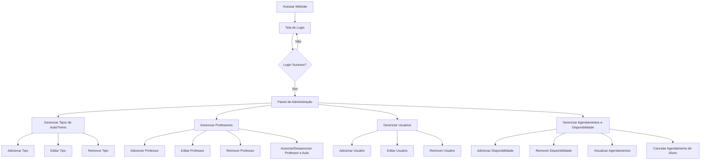

# Diagramas de Fluxo (User Flows)

## Fluxo de Usuário (Aplicativo Android - Aluno)

```mermaid
graph TD
    A[Abrir App] --> B{Usuário Cadastrado?}
    B -- Sim --> C[Tela de Login]
    B -- Não --> D[Contato com Academia]
    C --> E{Login Sucesso?}
    E -- Sim --> F[Tela Principal (Aulas Disponíveis)]
    E -- Não --> C
    F --> G[Selecionar Aula/Treino]
    G --> H[Ver Detalhes da Aula]
    H --> I{Confirmar Agendamento?}
    I -- Sim --> J[Agendamento Confirmado]
    I -- Não --> F
    J --> K[Ver Meus Agendamentos]
    F --> K
```

## Fluxo de Usuário (Website - Gerente da Academia)




